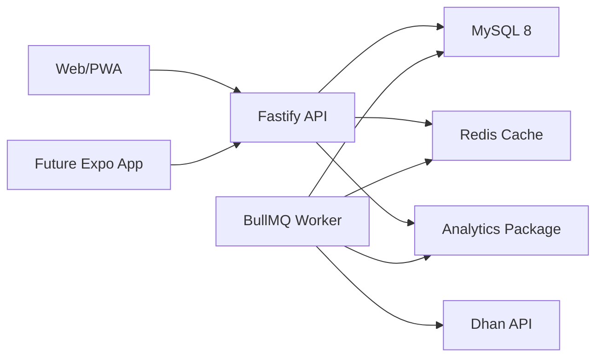

# Architecture

## Runtime Flow

## Key Boundaries

- Dhan credentials stay server-side in the API and worker.
- Live snapshots are written by workers, not browser sessions.
- Redis holds the latest market state and job state.
- MySQL remains the source of truth for replay, paper trading, users, and
  subscriptions.
- Analytics begins deterministic so every signal can be explained and tested.

## First API Surface

- `GET /health`
- `GET /api/market/overview`

The overview endpoint currently returns demo data so the dashboard can be built
before live Dhan polling is wired.

